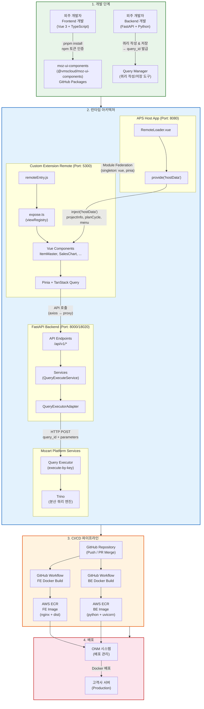
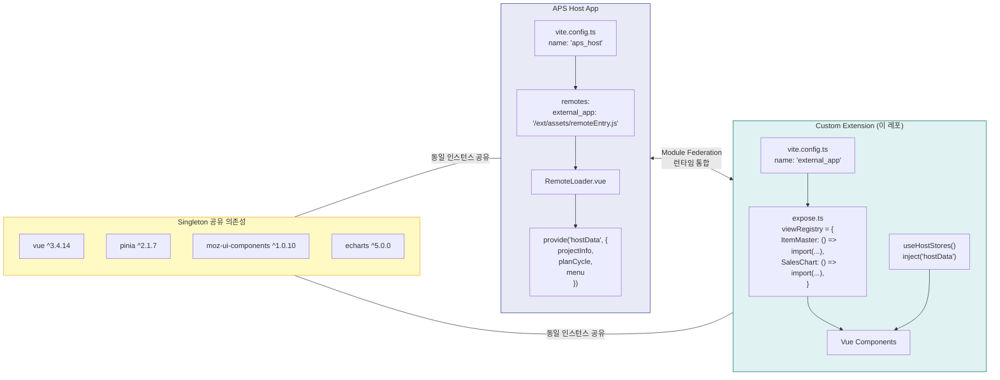
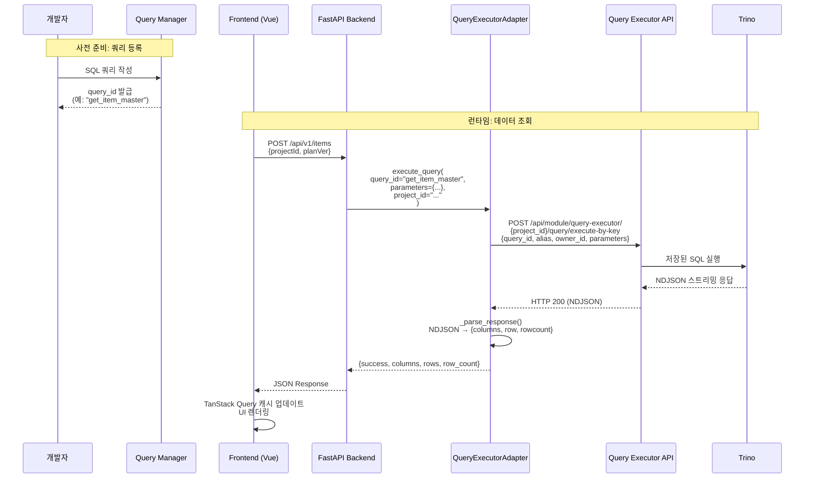
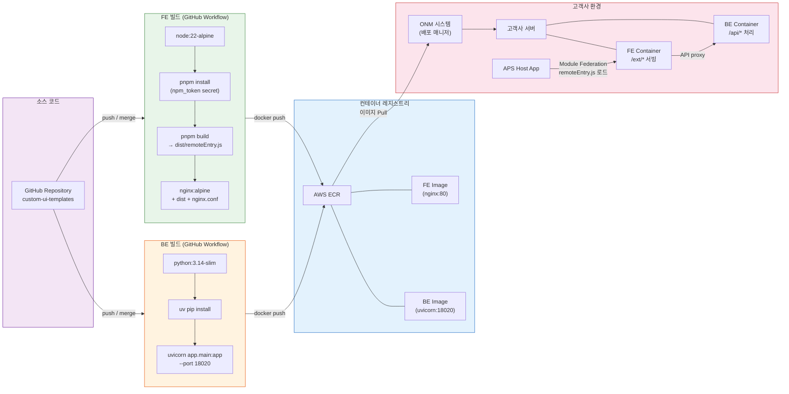
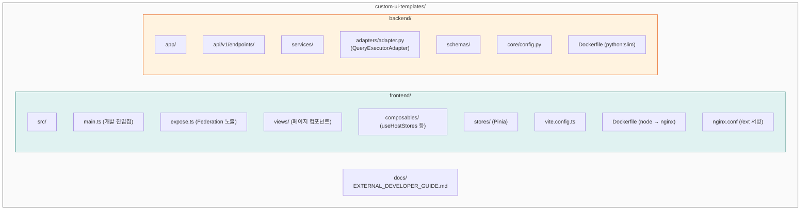

# Mozart APS - Custom Extension 개발 및 배포 아키텍처

## 1. 전체 개발-배포 파이프라인

---

## 2. Frontend 개발 흐름 (Module Federation)

---

## 3. Backend 데이터 흐름 (Query Executor)

---

## 4. CI/CD & 배포 파이프라인

---

## 5. 프로젝트 구조 요약

---

## 6. 핵심 포인트 요약

| 구분 | 설명 |
|------|------|
| **FE 라이브러리** | `@vmscloud/moz-ui-components` (GitHub Packages, npm 토큰 필요) |
| **FE-Host 연결** | Module Federation (`remoteEntry.js`), singleton 공유 (vue, pinia) |
| **Host → Remote 데이터** | `provide/inject` 패턴 (`projectInfo`, `planCycle`, `menu`) |
| **BE 쿼리 실행** | Query Manager에서 쿼리 저장 → `query_id` 발급 → `QueryExecutorAdapter.execute_query()` |
| **BE → Query Executor** | HTTP POST `/api/module/query-executor/{project_id}/query/execute-by-key` |
| **빌드** | GitHub Workflow → Docker (FE: nginx, BE: uvicorn) |
| **배포** | Docker Image → AWS ECR → ONM 시스템 → 고객사 서버 |
